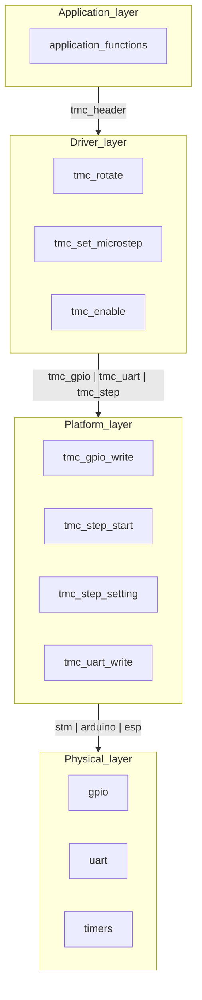

# TMC 2209 driver
This library is designed to manage the driver TMC 2209 and similar devices.

## Driver structure

For better portability across different platforms, the driver is divided into several layers.

The application layer is the user application that calls the driver functions. 
To access a specific device, an instance of the device structure is used.

The driver layer accepts a pointer to the device structure. This level is the top level of the driver and cannot be changed. 
The functions of this level consist of platform functions, and the device structure consists of structures of peripheral devices, also located at the platform level.

The level is subject to change when porting the project to other platforms. 
Functions in this layer accept peripheral device structures, which include everything needed to interface with a specific peripheral device, such as a uart or timer.

The physical layer represents the peripheral devices of the microcontroller

## Using the library

### 1. Implement the platform layer
First implement control functions for peripherals such as gpio, uart and timers.

- tmc_gpio_write(tmc_gpio) - work with gpio
- tmc_step_start(tmc_step) - enable driver steps
- tmc_step_stop(tmc_step) - disable driver steps
- tmc_step_setting(tmc_step) - configure driver step parameters
- tmc_step_count(tmc_step) - should be called after each step

These functions accept peripheral device descriptors, which are described in the header file

- struct tmc_gpio - parameters required for gpio operation
- struct tmc_step - parameters necessary for the implementation of step pulses
- struct tmc_uart - parameters required for uart operation